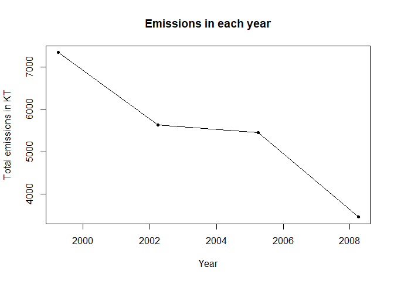
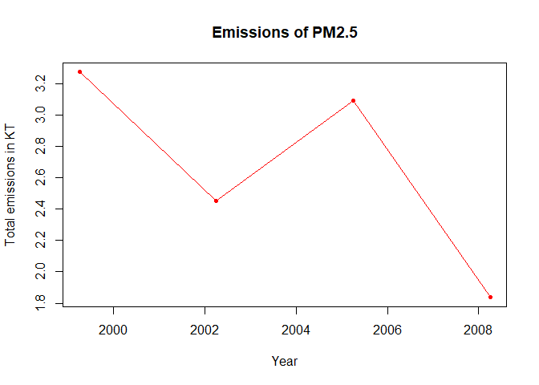
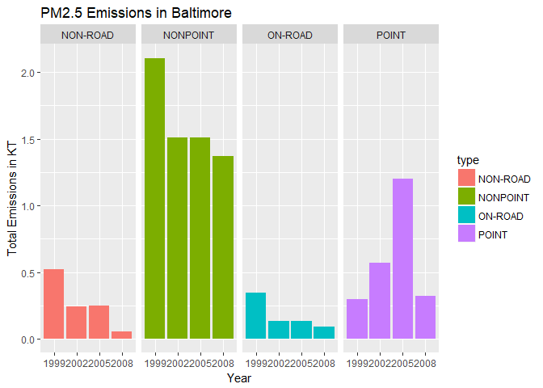
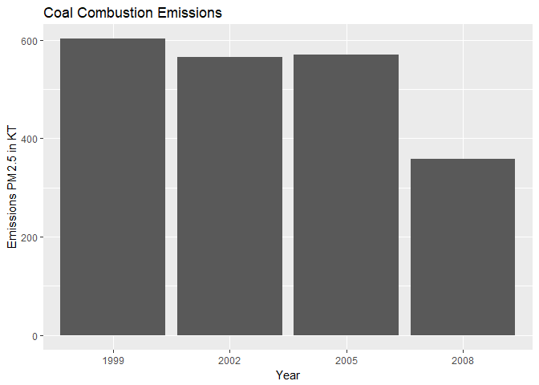
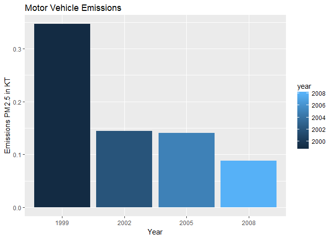
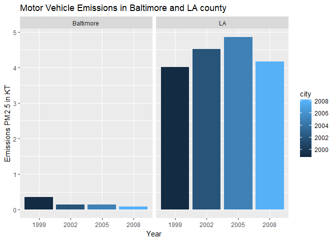

Exploratory Data Analysis on EPA NAtion al Emmission Inventory PM 2.5

Fine particulate matter (PM2.5) is an ambient air pollutant for which
there is strong evidence that it is harmful to human health. In the
United States, the Environmental Protection Agency (EPA) is tasked with
setting national ambient air quality standards for fine PM and for
tracking the emissions of this pollutant into the atmosphere.
Approximatly every 3 years, the EPA releases its database on emissions
of PM2.5. This database is known as the National Emissions Inventory
(NEI). You can read more information about the NEI at the EPA National
Emissions Inventory web site.

For each year and for each type of PM source, the NEI records how many
tons of PM2.5 were emitted from that source over the course of the
entire year. The data that I am going to use use for this project are
for 1999, 2002, 2005, and 2008.

The data for this assignment are available from the course web site as a
single zip file:

[Data for Peer
Assessment](https://d396qusza40orc.cloudfront.net/exdata%2Fdata%2FNEI_data.zip)

The zip file contains two files:

-   1.  PM2.5 Emissions Data (summarySCC\_PM25.rds): This file contains
        a data frame with all of the PM2.5 emissions data for 1999,
        2002, 2005, and 2008. For each year, the table contains number
        of tons of PM2.5 emitted from a specific type of source for the
        entire year. The variables are:
-   fips: A five-digit number (represented as a string) indicating
    the U.S. county
-   SCC: The name of the source as indicated by a digit string (see
    source code classification table)
-   Pollutant: A string indicating the pollutant
-   Emissions: Amount of PM2.5 emitted, in tons
-   type: The type of source (point, non-point, on-road, or non-road)
-   year: The year of emissions recorded

-   1.  Source Classification Code Table
        (Source\_Classification\_Code.rds): This table provides a
        mapping from the SCC digit strings in the Emissions table to the
        actual name of the PM2.5 source. The sources are categorized in
        a few different ways from more general to more specific and you
        may choose to explore whatever categories you think are
        most useful. For example, source "10100101" is known as "Ext
        Comb /Electric Gen /Anthracite Coal /Pulverized Coal".

The overall goal of this project is to explore the National Emissions
Inventory database and see what it say about fine particulate matter
pollution in the United states over the 10-year period 1999-2008.

    library(ggplot2)
    library(lubridate)

    ## 
    ## Attaching package: 'lubridate'

    ## The following object is masked from 'package:base':
    ## 
    ##     date

    ##reading the table
    NEI <- readRDS("summarySCC_PM25.rds")
    SCC <- readRDS("Source_Classification_Code.rds")
    dim(NEI)

    ## [1] 6497651       6

    dates <- NEI$year
    head(dates)

    ## [1] 1999 1999 1999 1999 1999 1999

    dates <- as.Date(as.character(dates), "%Y")
    str(dates)

    ##  Date[1:6497651], format: "1999-04-02" "1999-04-02" "1999-04-02" "1999-04-02" "1999-04-02" ...

    NEI$Emissions <- NEI$Emissions/1000 ##converting into kilo tons

    ## Plot 1
    ## Finding total number of emissions in each year
    x = tapply(NEI$Emissions, NEI$year, sum)

    plot(unique(dates), x, xlab = "Year", ylab = "Total emissions in KT", pch= 20,type = "o",lty = 1, main = "Emissions in each year")

From the plot, the line chart shows a decreasing trend as we move across
the years from 1999 to 2008. Thereby, the total no of emissions is
decreasing from all sources over the years.

    ## Plot2
    ## Subsetting Baltimore City, Maryland (fips == "24510") from NEI
    Baltimore <- unique(subset(NEI, fips == 24510))

    ## Counting total no of emissions in each year using tapply
    Baltimore_sum <- tapply(Baltimore$Emissions, Baltimore$year, sum)

    plot(unique(dates), Baltimore_sum, xlab = "Year", ylab = "Total emissions in KT", pch= 20,type = "o",lty = 1, main = "Emissions of PM2.5", col = "red")

From the line chart, the total no of emissions is first decreased from
1999 to 2002, then followed an incresing trend till 2005, and then again
decreasing till 2008.

    ## Plot3
    g <- ggplot(Baltimore, aes(factor(year), Emissions, fill = type))
    g+ geom_bar(stat = "identity")+ facet_grid(.~type)+
      labs(x="Year", y = "Total Emissions in KT", title = "PM2.5 Emissions in Baltimore")

    ## Plot4
    ## Merging SCC and NEI dataset and then subsetting the data frame containg coal and combustion.
    y <- merge(NEI,SCC, by = "SCC")
    coal_data <- y[grepl("coal", y$Short.Name,ignore.case=TRUE),]
    g1 <- ggplot(coal_data, aes(factor(year), Emissions))
    g1 + geom_bar(stat = "identity") + labs(x="Year", y = "Emissions PM2.5 in KT",title = "Coal Combustion Emissions")

From the bar plot, the no of emissions across USA for coal combustion
related data decreases from 1999 to 2002, followedby an increase in 2005
and then decreasing trend in 2008.

    ## Plot5
    ## Merging baltimore dataset and SCC together and extract rows containg motor vehicle sources
    z = merge(Baltimore, SCC, by = "SCC")
    vehicle_data <- z[grepl("Veh", z$Short.Name,ignore.case=TRUE),]
    g2 <- ggplot(vehicle_data, aes(factor(year), Emissions))
    g2 + geom_bar(stat = "identity", aes(fill = year)) + 
         labs(x="Year", y = "Emissions PM2.5 in KT",title = "Motor Vehicle Emissions")

The bar graph shows that there is a decreasing trend in total no of
emissions as we move from 1999 to 2008 for motor vehicle related data

    ## Plot6
    California <- unique(subset(NEI, fips == "06037"))
    z1 <-  merge(California, SCC, by = "SCC")
    vehicle_data1 <- z1[grepl("Veh", z1$Short.Name,ignore.case=TRUE),]
    vehicle_data$city <- "Baltimore"
    vehicle_data1$city <- "LA"
    Balt_Cal <- rbind(vehicle_data,vehicle_data1)

    g3 <- ggplot(Balt_Cal, aes(x=factor(year), y=Emissions, fill=city))
     g3 +  geom_bar(aes(fill=year),stat="identity") +
      facet_grid(scales="free", space="free", .~city) +
      labs(x="Year", y = "Emissions PM2.5 in KT",title = "Motor Vehicle Emissions in Baltimore and LA county")

From the plot, the motor vehicle emissions decreases across in Baltimore
over the years, whereas for LA county, the emissions show a increasing
trend till 2005 and then decreases in 2008.
